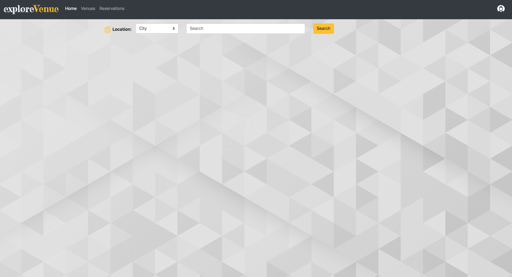
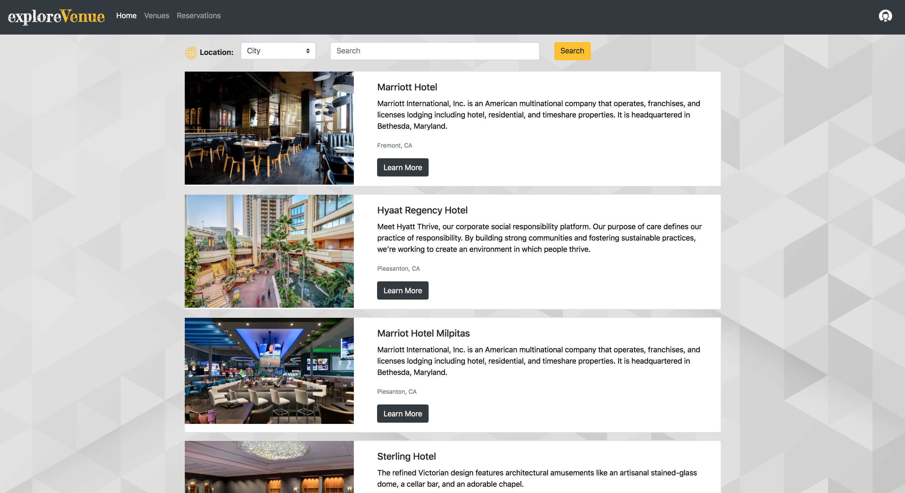
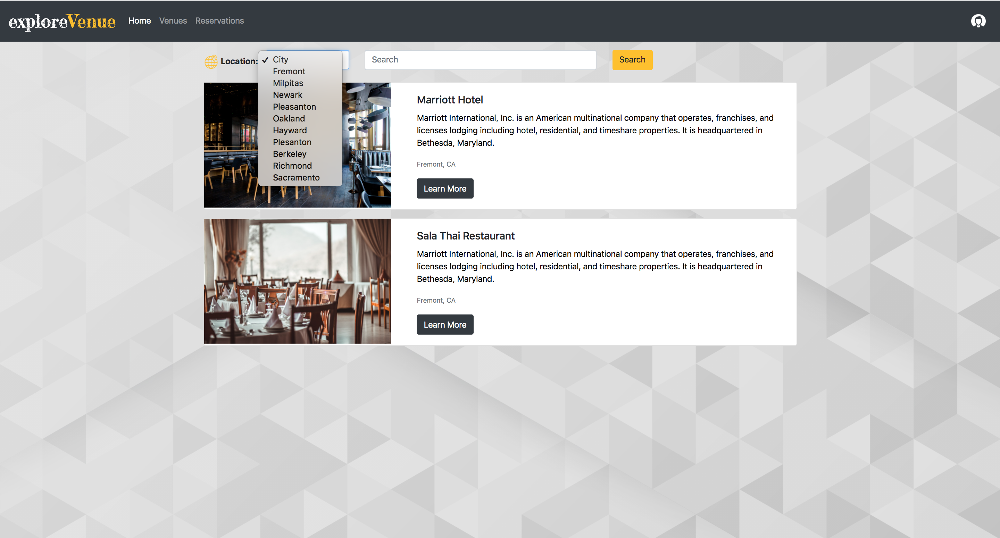
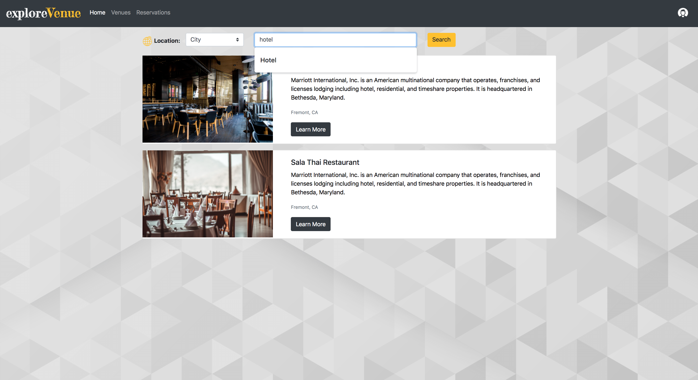
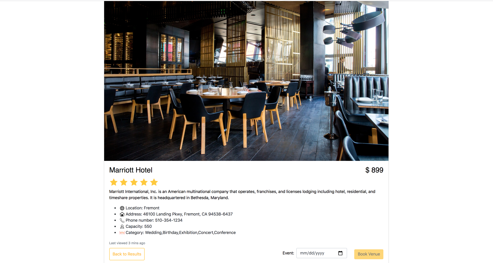
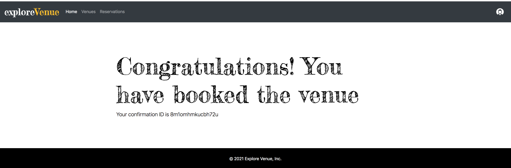
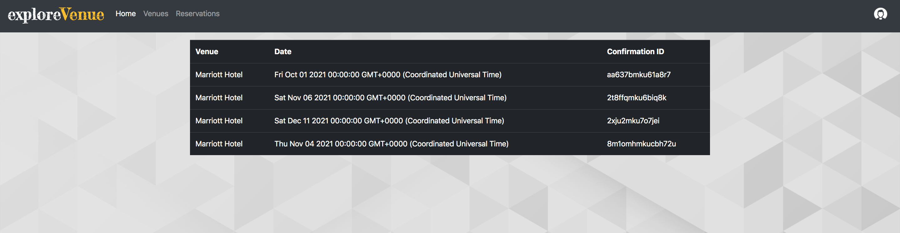
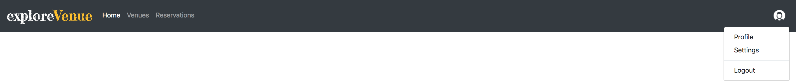

# Explore Venue
  ## Description  
  ExploreVenue is a web application that is specifically designed to provide an easy solution to the nerve-racking problem of host experience when they are initially booking an appropriate venue for an occasion.

  ## Table Of Content  
  * [User Story](#userstory)
  * [Installation](#installation)
  * [Usage](#usage)
  * [Screenshots](#screeshots)
  * [Contributor](#contributor)
  * [Questions](#questions)

  ## User Story
    AS A user,
    I WANT to search for a venue by title or location 
    SO THAT I can view venues and their details and check if they’re available on specific date for booking an event.

    ## Installation  
  To install dependencies run this command 

  ```npm install```

  ## Usage  
  Providing a lasting solution to booking services that inspires clients to enjoy their event instead of stressfully managing it”


  ## License  
    None

## Screenshots
### Home Page
  
### Signup Page
  
### Login Page
  
### Search Result Page
  

### List of All Venues


### Search with Location


### Search with title


### Single Venue Page with Details


### Booking Confirmation Page


### View Reservation Page


### Logout Dropdown in Navbar


  ## Technologies

    Node.js 
    Express.js
    Template Engine handlerbars
    Mysql 
    Sequelize ORM
    bcrypt
    NPM
    New Package: uniqid() package for booking confirmation
    RestFull APIs (Get , Post)
    HTML, CSS, Javascript, JQuery
    Bootstrap

## Live Link
https://explore-venue.herokuapp.com/

## GitHub Repo Link
https://github.com/mehak-zehra/explore-venue

  ## Contributor  
  Mehak Zehra 
  Kyle Balingit
  ## Questions  
  - - -
  For questions about this project, please see my GitHub at [mehak-zehra](https://github.com/mehak-zehra)  (Or) 

  Contact me at mehak.rizvi.786@gmail.com